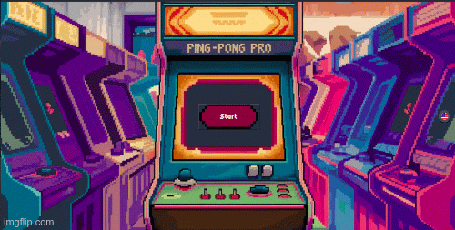

# ft_Transcendence

A web-based multiplayer Pong game built as a single-page application.  
It includes real-time gameplay, user authentication, and integrated chat, all powered by a Django backend and vanilla JavaScript frontend, fully containerized with Docker.



---

## Team
**[Anita](https://github.com/Alaire1)** **[Tony](https://github.com/tonywilliamspiano)** **[Noah](https://github.com/Nuloiz)** **[Jonas](https://github.com/jonaspeters85)** **[Arafa](https://github.com/ankinzin)**

---
## Architecture

### Backend (Django)
- Handles user management (registration, authentication)  
- WebSocket support (e.g., Django Channels) for real-time gameplay and chat  
- REST endpoints for user profile, game data, etc.

### Frontend (Vanilla JS SPA)
- Single-page application using HTML, CSS, and JavaScript  
- Connects via WebSockets for live game events and chat  
- Interfaces with Django’s REST API for authentication and game lifecycle

### Docker & Orchestration
- `Dockerfile` and `docker-compose.yml` included—for backend, frontend, and Nginx  
- Separate services allow containerized development and seamless deployment

---

## Features
### 🎮 Gameplay
- Classic Pong game implemented in the browser
- Real-time multiplayer matches over WebSockets
- Tournament mode supporting multiple players
- Matchmaking system (manual invites and automatic pairing)
- Accurate ball & paddle physics handled server-side
- Score tracking and persistence for each match

### 👤 User & Authentication
- User registration and login system
- JWT-based authentication & authorization for secure stateless access control
- All protected API endpoints require a valid JWT
- Tokens are continuously checked and refreshed when expired to maintain valid sessions
- Secure password hashing with Django’s built-in authentication system
- Two-factor authentication (2FA) for enhanced account security
- User profiles with stats (matches played, wins/losses, tournaments)
- Customizable avatars & usernames
- Session persistence

### 💬 Communication
- Real-time chat system over WebSockets
- Powered by Django Channels with Redis as the channel layer
- Global chat room for community interaction
- Private one-to-one chat between players

### 🌐 Frontend (SPA)
- Single-Page Application **(SPA)** built with Vanilla JavaScript, HTML5, and CSS3
- Custom CSS styling with multiple themes/backgrounds for different app sections (login, game, chat, profile)
- Responsive design for desktop, tablet, and mobile devices
- Dynamic DOM rendering for live updates of game state, chat messages, and user lists
- Multi-language support: English, Polish, and German (internationalization)
- Client-side routing with History API:
  - Smooth navigation between pages without full reloads
  - Browser back/forward buttons supported correctly
  - JWT-protected routes with access control for logged-in users
- Asynchronous communication with backend via REST API (Django REST Framework) and WebSockets
- Secure token handling with JWT: checks for expiration, refreshes tokens automatically
- Full SPA “engineering”: routing, authentication, internationalization (i18n), and history management handled correctly, not just static HTML pages

### ⚙️ Backend (Django)
- Built with Django + Django REST Framework (DRF)
- **JWT** authentication flow with refresh tokens
- Django Channels for WebSocket handling (real-time game + chat)
- PostgreSQL for persistent storage
- Modular app design (auth, game, chat, tournament management)
- RESTful endpoints for authentication, user data, and match history

### 🐳 Deployment & DevOps
- Docker Compose for multi-container orchestration
- Isolated networks between containers for secure communication
- Environment configuration via .env file (SECRET_KEY, JWT settings, DB creds)

--- 
## Environment Variables (.env)
To run ft_transcendence locally or in Docker, create a .env file in the backend folder with the following variables:
### Database Configuration
```
DB_NAME=                # Name of your main database (SQLite or PostgreSQL)
DB_API=                 # API database name (if separate)
DB_USER_API=            # Database username
DB_PASSWORD=            # Database password
DB_HOST_API=            # Database host (e.g., localhost)
DB_PORT_API=            # Database port (e.g., 5432 for Postgres)
HOST_IP=                # IP address of the machine running the backend
```
### PostgreSQL
```
POSTGRES_PASSWORD=      # Password for PostgreSQL
POSTGRES_USER_API=      # PostgreSQL username
POSTGRES_DB_API=        # PostgreSQL database name
```
### Authentication
```
JWT_SIGNKEY=            # Secret key for signing JWT tokens
```
### 42 API Integration
```
INTRA_UID_42=           # Your 42 API client ID
INTRA_SECRET_42=        # Your 42 API secret
REDIRECT_URI=           # Redirect URI for OAuth login
```
### Superuser (Django Admin)
```
SUPERUSER_NAME=         # Username for Django admin
SUPERUSER_EMAIL=        # Email for Django admin
SUPERUSER_PASS=         # Password for Django admin
```
